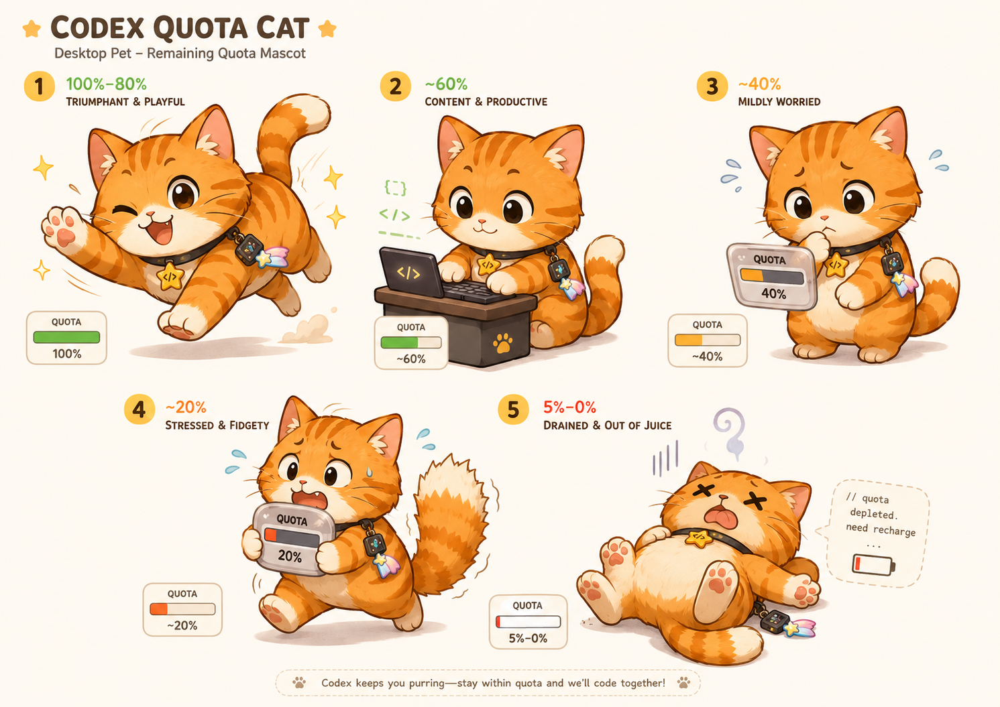
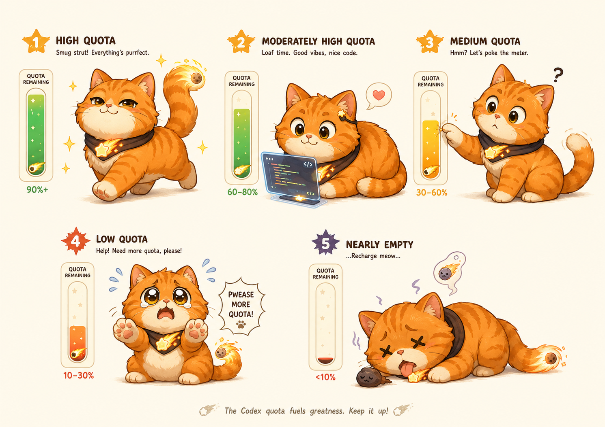
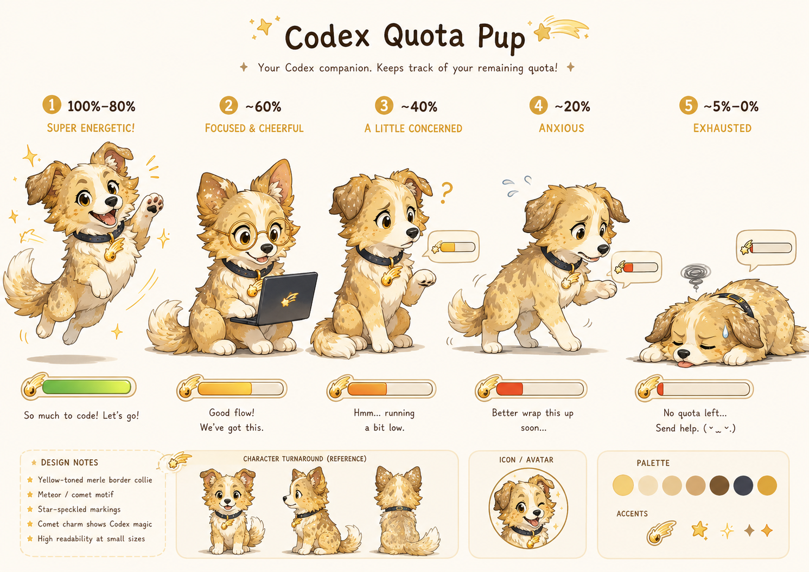
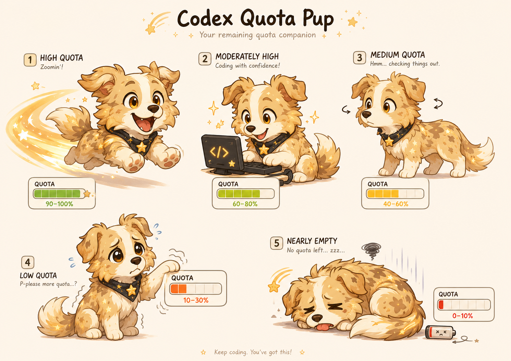

# Codex Companion

Codex Companion 是一个常驻 Windows 桌面的 Codex 用量小宠物。它通过本机 Codex app-server 展示通用 5 小时额度、每周额度和今日 Token，不需要 API Key。

默认界面只保留宠物与配套的 5h 能量槽；鼠标悬停后显示双圆环额度仪表和今日 Token。可以在小狐、陨石边牧与大橘猫之间切换，宠物会根据 5h 剩余额度自动进入五种状态；仅在 5h 数据缺失时回退到 weekly：

- 80–100%：活力满满
- 60–80%：专注工作
- 40–60%：观察额度
- 10–40%：紧张提醒
- 0–10%：休眠耗尽

## 设计稿

<p align="center">
  
  
</p>

<p align="center">
  
  
</p>

## 功能

- 通用 Codex 5 小时与每周剩余额度
- 今日 Token 使用量
- 小狐、陨石边牧、大橘猫三种形象
- 五档额度状态与配套表情、动作、颜色
- 透明置顶、拖动、托盘驻留、开机启动与实时刷新
- 本机读取，无需 API Key

## 开发

需要 Node.js 20 或更高版本。

```powershell
npm install
npm start
```

运行测试与构建 Windows 安装包：

```powershell
npm test
npm run dist
```

## 数据与隐私

额度通过本机官方 `codex app-server` 的 `account/rateLimits/read` 获取，并固定使用通用 `limitId = "codex"`；Spark 独立额度不会混入。今日 Token 优先读取账户当日档，必要时使用本机会话事件补齐。

Codex Companion 不读取或保存登录令牌，也不保留提示词、回复内容或文件内容。

## License

[MIT](LICENSE)
